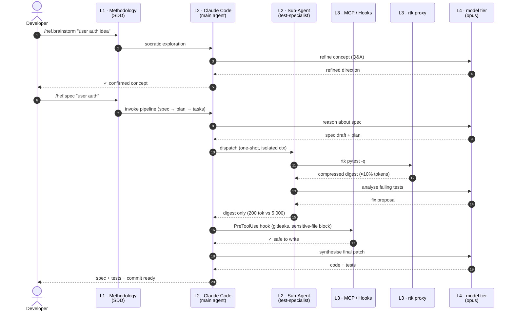

# Architecture

[← back to README](../README.md)


## 📁 Package Structure

The repository *is* the plugin. The manifests live in `.claude-plugin/`; the payload they point at
lives at the **repository root**.

```
hefesto/
├── .claude-plugin/
│   ├── plugin.json             # the plugin manifest — declares every component below
│   └── marketplace.json        # makes the repo installable (`claude plugin install`)
├── .mcp.json                   # GitHub MCP server (project scope)
├── agents/                     # 7 agents (5 pipeline + repo-scout and truth-scout one-shot)
├── commands/                   # 26 slash commands, all hef.*
├── hooks/                      # 15 hooks + hooks.json; helpers: release.sh, speckit-helper.sh (46 subcommands), status-board.sh, ledger.sh, session-launch.sh, pr-watch.sh, arena-run.sh
├── skills/                     # 7 skills, each a <name>/SKILL.md directory
├── workflows/                  # workflow.js — the deterministic task-list executor
├── tests/                      # smoke.sh (structural/regression + opt-in live tiers) and workflow.test.js (node --test)
├── evals/                      # 12 `claude plugin eval` cases (opt-in; /hef.doctor --eval)
├── docs/                       # this documentation
├── .claude/                    # THIS repo's own config — not plugin payload
│   ├── CLAUDE.md
│   └── rules/                  # 5 modular policy files
└── reports/                    # 18 research files: the "why" behind the rules
```

> **The payload deliberately does not live under `.claude/`.** That path is where Claude Code looks
> for *project-scope* config, which outranks both plugins and built-ins — so shipping the payload
> there meant that, while working in this repo, the commands resolved to the repo's own copies and
> behaved differently than in any real install. The framework was never dogfooded *as a plugin*, and
> three bugs shipped because of it. `tests/smoke.sh` now fails if any payload directory reappears
> under `.claude/`. See the 5.0.0 entry in `CHANGELOG.md`.

> `CLAUDE.md` and `rules/` are **not** plugin components — a plugin cannot ship them. They apply when
> this repo *is* your project, or when you copy them into `~/.claude/` yourself (see
> [Installing & Configuring](install.md)). Everything else in the tree is shipped by `plugin.json`.

---


## 🔁 Request Flow & Stack Composition

The harness composes 5 layers — **methodology** (the `hef.*` workflow: spec-driven, with a fix path and a size router), **agent runtime** (Claude Code), specialised **sub-agents**, **integrations** (MCP, hooks, rtk, security CLIs), and **models** (the `fable` / `opus` / `sonnet` / `haiku` *tiers* — aliases each environment binds to concrete models; commands, agents, and workflow spawns pin a tier, never a model ID) — with cross-cutting governance for quality, security, context, and memory. A single feature request traverses every layer:



### What the flow reveals

- **L1 (methodology) shapes thinking, not state.** the SDD pipeline (`/hef.brainstorm`…) defines structure but holds no conversation context.
- **Sub-agents isolate context.** Dispatched in fresh contexts and discarded — only the digest returns. Primary defence against the >40% "Dumb Zone".
- **rtk compresses CLI output (60–90%) before it reaches the main context** — the highest-leverage token optimisation in the framework.
- **Hooks enforce the gates deterministically** (gitleaks on commit, the sensitive-file and destructive-command blocks, the TaskCompleted test gate); the security boundary itself is OS sandboxing (`/sandbox`), which a string-matching hook cannot be.
- **Models are stateless** — every layer above exists to give them the right context and route their output safely.

### Currently In Use vs Available

| Component | Status | Notes |
|-----------|--------|-------|
| SDD pipeline | ✅ active | Full pipeline incl. `/hef.brainstorm` → `spec` → `plan` → `review` → `tasks` → `implement` → `verify` |
| OpenSpec | ⚪ not adopted | Alternative spec workflow |
| Superpowers | ⚪ pattern reference | Skill-pack architecture is the influence |
| Claude Code | ✅ primary runtime | Session model per profile; each command pins a tier |
| Codex · Opencode · Cursor · Aider | ⚪ alternatives | Alternative runtimes — the methodology layer would still apply; the Codex and Gemini CLIs are also usable as arena providers |
| Foreign providers (`codex`, `gemini`, `claude`, `aws`) | ⚙️ opt-in | Declared under `providers` in `.claude/project-status.json`; run read-only by `hooks/arena-run.sh` as `/hef.plan --arena --via` readers and the `/hef.review --second-opinion` source; never the gate; `aws` refused for the arena |
| MCP: github | ⚙️ project-scoped | Root `.mcp.json`; needs `GITHUB_TOKEN` exported |
| MCP: Semgrep, Snyk, SonarQube | ⚪ optional | Add only when CLI scans aren't enough |
| **rtk** | ✅ available (auto-detected per machine) | 60–90% token reduction on common dev commands |
| Fabric | ⚪ pattern reference | Reusable prompt-pattern library |
| gitleaks · semgrep · trivy · ruff · gosec | ✅ via Bash | Quality / security CLIs |
| `fable` / `opus` / `sonnet` / `haiku` tiers | ✅ aliases | Cheap generation, expensive judgment — the policy in `.claude/CLAUDE.md`; `claude-bedrock()` rebinds them |
| GPT · Gemini · Qwen · Llama | ⚪ alternatives | Foundation models from other providers |

---


## 🧵 Multi-session orchestration

`/hef.orchestrate` reads the board (a `tasks/` kanban or a GitHub Project, declared in
`.claude/project-status.json`), registers the item in the **ledger** — one JSON file per item at
`<git-common-dir>/hefesto/ledger/<id>.json`, shared by every worktree, never committed — and
`hooks/session-launch.sh` starts a fresh headless worker (`env HEFESTO_WORKER=1 claude -p …`) in
`.claude/worktrees/<id>` with a tier, a budget cap and a tool allowlist per role (`plan` /
`implement` / `verify` / `deploy`). A **separate verifier** that never sees the author's transcript
judges the result; its tier must rank at least the author's. Only the launcher writes the ledger.
Blocks (`human:*`, `verdict`, `stall`, `budget`, `conflict`, `ci`) are announced at session start to
the pane that owns them (`orchestrate.panes`); opt-in `orchestrate.publish` writes each item's state
onto the board and `escalate_after_hours` sends one pointer for a stale human block. `/hef.babysit`
(`hooks/pr-watch.sh`) keeps a PR moving to the merge gate; `/hef.status` reports AI-delivery metrics
from the ledger. A `branches` block names the integration branch (PR base, verifier diff base,
`human:merge` check), the protected heads, and the promotion chain whose last branch is `released`.
**No pane and no worker ever merges** — the merge is the human gate. See README §5,
[install §7](install.md) and `reports/17`.

## 🖥️ Reference Deployment

This is the topology I run the framework on. The framework itself is host-agnostic — this section just documents one tested setup with explicit trust boundaries.

### 🔀 Two-Machine Topology

| Role | OS | Production Access | Always-On | Used For |
|------|-----|-------------------|-----------|----------|
| 💻 **Primary laptop** | Manjaro Linux | ✅ Full | ❌ No | Day-to-day dev, production deploys, attended sessions |
| 🖧 **Always-on remote workstation** | Arch Linux | ❌ GitHub only | ✅ Yes | Long-running tasks, mobile resume target, off-hours work |

Both machines install the **same plugin** from the same clone, so Claude Code behaviour is identical on each: same agents, hooks, skills, workflows, MCP server. Only the per-host `settings.json` (env vars, the helper permission rule, hook timeouts) differs — which is exactly the machine-local part a plugin cannot ship.

### 🛡️ Trust Boundaries

The blast-radius asymmetry is deliberate:

- 🔐 **Production credentials live only on the laptop.** It is offline most of the time and physically attended.
- 🌐 **The always-on workstation can reach GitHub but not production.** A compromise of the higher-exposure host (always online) cannot pivot into production systems.
- 🔗 **Network is Tailscale-only.** Strict ACLs constrain which hosts can reach which services — no public IPs, no port-forwarding, no inbound exposure.
- 👁️ **Wazuh monitors the whole stack** — file-integrity monitoring, auth events, command auditing — across both machines and any production hosts.

### 🌐 Why the Topology Matters for AI Agents

Claude Code's session-portability features pair naturally with this setup:

- ▶️ Start a long-running task on the **always-on workstation** before stepping away
- 🔄 Resume from the **laptop** later via `/teleport` (see [Multi-Environment Workflows](performance.md#-multi-environment-workflows))
- 📱 Or — start on **mobile** (claude.ai/code), pull into the laptop terminal when home

Critically, the always-on workstation can **autonomously work on GitHub repos** (review PR feedback, run CI, commit fixes) without ever holding production credentials. The laptop holds the keys; the always-on host holds the time.

---

